# Car Detection and Counting by Yolov4
# 車輛偵測與計數
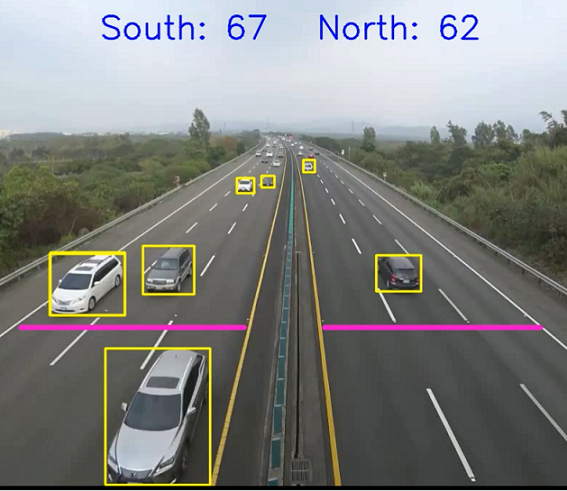
***
+ ## 目的
### 前面寫了篇簡單飛鳥標記訓練與偵測的介紹，但更貼近我們生活的，應該是馬路上那川流不息的車輛，尤其是逢年過節，高速公路上或是各大景區爆量的車潮，總是讓交通部頭疼萬分。
### 雖然ETC可以充當記錄高速公路上的車輛數量用途，但其實更重要的是更大範圍的車流大數據，如果可以事先知道遠處的車輛數量與動向，那整體交通就可以做提早的路線變更或是疏導，或是聰明用路人在前往熱門觀光景區前就可以知道景區內外或甚至路途中前往的車輛數量，可以提前趨吉避凶…
### 那麼，如果可以把各馬路上的監視攝影機的即時車流影像都拿來善加利用，搭配電腦高效率的偵測與計數，相信未來的交通大數據能夠讓交通生活更加便利與順暢。
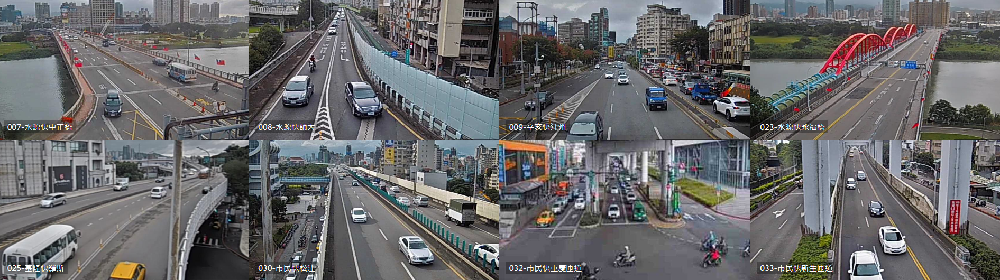
***
+ ## 資料集(dataset)
### 機器學習最重要的就是資料集(dataset)，這次的目的在於車輛偵測，那麼就需要事先準備好一堆不同種類的車子圖片用來訓練用。事實上，已經有很多學術單位或機構有收集過大量的圖片可供使用，這邊就以現成的 coco(2017)當作訓練集使用。
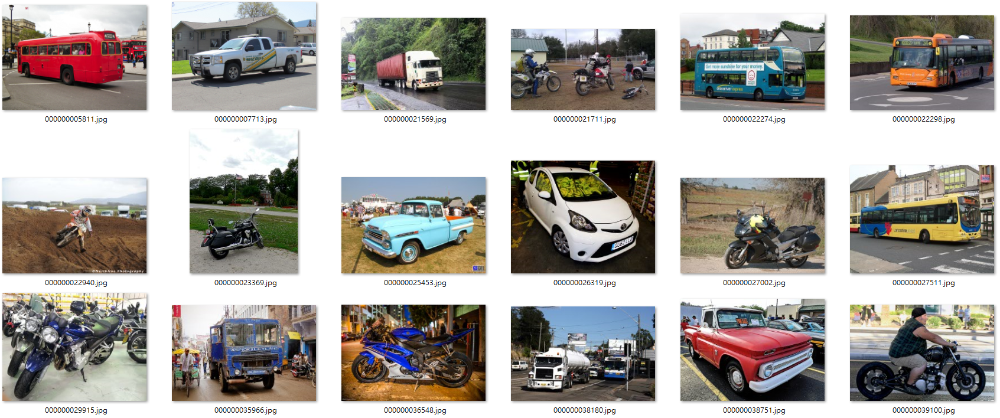
### coco 資料集內包含有 80 種不同種類的照片(人、車、動物、各式物品等)，光是車子就有腳踏車、摩托車、汽車、公車、卡車、火車等六類，這邊主要以馬路上的車輛為主，故抓取其中的 摩托車、汽車、公車、及卡車 當作訓練集。這邊除了將圖片取出放在資料夾之外，另外也同時需要修改一下 coco.yaml 內容。
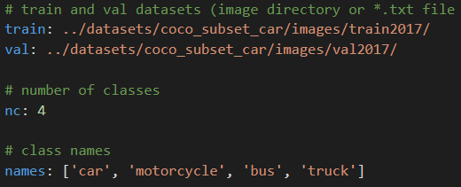
***
+ ## 模型訓練(model training)
### 模型的完整訓練稍後會另外寫一篇介紹，這邊就做個簡單的訓練結果呈現，但是 coco 圖片集的數量十分龐大，訓練起來需要消耗非常大量的運算資源，以google colab或是自家機器跑都無法做大模型與長時間的訓練，故此處只有做 Yolo v4 小模型(s) 50 與 100 epochs 的比較。
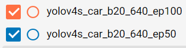
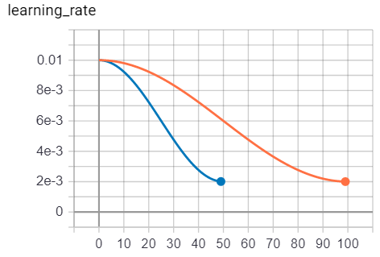
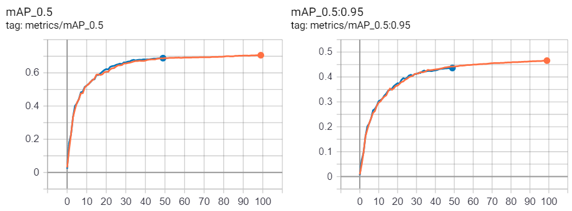
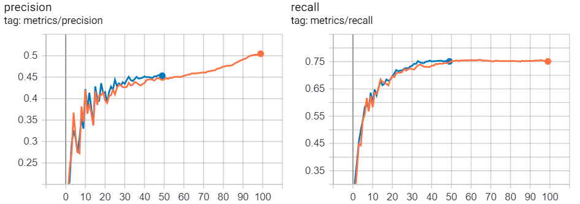
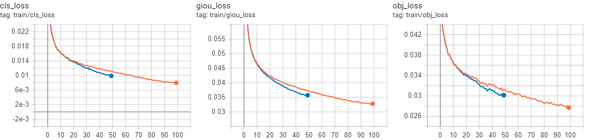
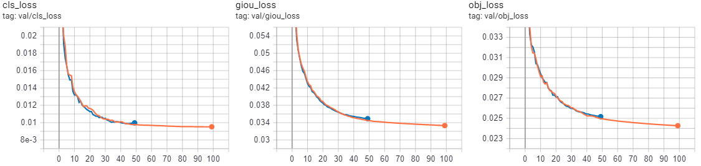
### 看的出來如果訓練時間再增加可以讓精確度更高以及損失更小，不過資源有限的情況下只能以這個結果接著做下去啦。
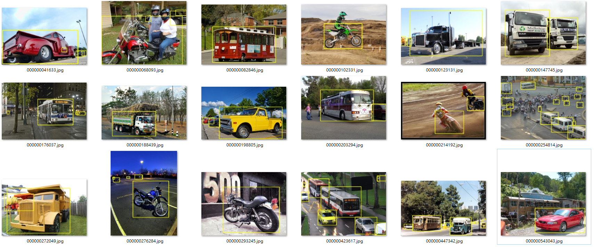
### 實際模擬的結果也還不錯，主要還是小物件和重疊物件的效果較差，但這本來就是物件偵測訓練上的大難題啊。
***
+ ## 物件追蹤(tracking)
### 如果要把物件偵測實際運用到現實環境應用之中，那麼就必須對即時路況影片中的車輛作預測，隨著時間更迭，車輛也會隨之變更位置，或甚至固定攝影畫面中總是會車子離開畫面或是進入畫面，那車輛計數就需要針對影片的前後幀幅(frame)中的車子做物件追蹤(tracking)，好判斷畫面中的物件是否是相同。
### 物件追蹤在機器學習中也是一門領域，個人沒有研究過這方面，所以這邊就拿最基本的Sort套件來偵測，但是在更複雜的道路環境中，需要用到更新更準確的相關追蹤套件。Sort會將餵進去的圖片與邊界框做紀錄與運算，並給予每個邊界框一個編號(id)，這個編號就可以拿來當作計數使用。
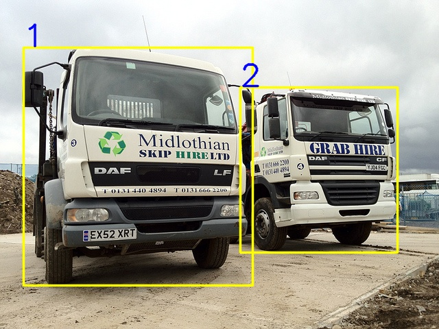
***
+ ## 車輛計數
### 有了每個邊界框的位置(x,y)與編號(id)，那就可以針對圖片中的特定位置設定條件來作為車輛通過的判斷與否。以下面高速公路南北向為例，紫色線條是作為通過與否判斷的條件，圖片也分為左邊和右邊分別表示南下與北上，那搭配上Yolo預測的車輛邊界框與編號，就可以完成基本的車流計數囉～

###### 圖片/影片來源: Google / Youtube (擷取部分片段，如有侵權，請來信告知，會予以刪除)

